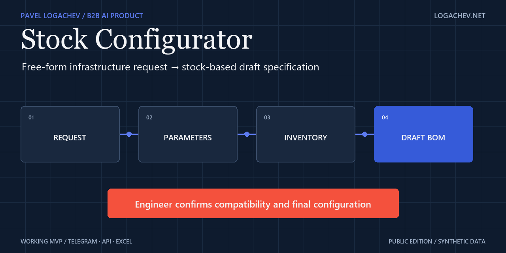
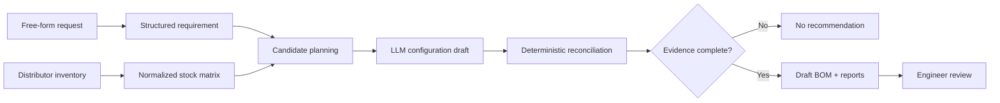

# Stock Configurator

**A working infrastructure-presales MVP that turns a manager's free-form request and distributor stock into a reviewable draft specification with explicit assumptions.**

[Product case](https://logachev.net/portfolio/stock-configurator/) · [CI](https://github.com/pavel-logachev/stock-configurator/actions/workflows/ci.yml) · [Architecture](docs/ARCHITECTURE.md) · [Run locally](docs/LOCAL_DEVELOPMENT.md) · [AGPL-3.0](LICENSE)



> Product-flow diagram based on synthetic data. It is not a UI screenshot or a customer artifact.

## At a glance

| | |
| --- | --- |
| **For** | Infrastructure sales and presales teams, with final review by an engineer |
| **Input** | A free-form server, storage, or networking request plus authorized distributor inventory |
| **Output** | A draft BOM, concise summary, and Excel report with assumptions and open questions |
| **Interfaces** | Telegram, FastAPI, and downloadable Markdown or Excel reports |
| **Decision boundary** | Code validates identifiers, quantities, prices, evidence, and result state; an engineer confirms compatibility and commercial readiness |
| **Status** | Working private MVP; this repository is the sanitized clean-room public edition |

## Why this exists

Infrastructure requests rarely arrive as clean bills of materials. They arrive as messages such as:

> Нужны два сервера 2U, два процессора, 512 ГБ RAM, SSD, два блока питания, склад Москва.

Turning that sentence into a commercial draft requires several different kinds of work:

- extracting a structured requirement without silently inventing details;
- mapping it to current distributor inventory;
- reasoning about compatibility and enablement parts;
- preserving prices and product identifiers exactly;
- explaining gaps instead of forcing a recommendation;
- producing an artifact an engineer can review and hand off.

Stock Configurator separates those responsibilities. Language models handle semantic extraction and composition. Deterministic code owns integrations, persistence, validation, evidence, report generation, and release gates.

## Pavel Logachev's role

I designed and built Stock Configurator as an independent product around a workflow I know from B2B IT and systems integration. My work covers the product logic, Telegram operator flow, FastAPI service, distributor-data boundary, evidence and reconciliation layer, Excel output, evaluation contracts, and public-release engineering.

The [portfolio case](https://logachev.net/portfolio/stock-configurator/) explains the user workflow and result. This repository provides the inspectable implementation, tests, architecture, and explicit publication boundary.

## Public edition status

This repository is an **AGPL-3.0 clean-room public edition** derived from a working private project.

Included:

- FastAPI service and PostgreSQL persistence;
- OCS and Treolan connector implementations;
- Telegram bot integration;
- request extraction, matching, composition, reconciliation, and reports;
- Markdown and Excel outputs;
- offline evaluation contracts and synthetic fixtures;
- migrations and automated tests.

Intentionally excluded:

- private Git history and agent state;
- credentials and deployment configuration;
- customer requests and distributor payloads;
- live prices, stock snapshots, model outputs, and accepted golden cases;
- production run identifiers and operational metrics.

The public synthetic baseline proves the mechanics of the pipeline and its test gates. It is not evidence that a particular model or distributor account will produce a commercially acceptable configuration. See [Public release boundary](docs/PUBLIC_RELEASE_BOUNDARY.md).

## Safety boundary

The system produces a **draft**, never an approved configuration.

A result can be:

- `quote_draft_review_required` - enough grounded evidence exists to prepare a draft, but engineering review is mandatory;
- `no_recommendation` - the evidence is incomplete or a safe configuration cannot be established;
- blocked or failed - input, evidence, or evaluation requirements were not met.

A model cannot approve compatibility, invent a SKU, override stock evidence, or promote a draft to a final commercial offer. Those transitions remain deterministic or human-controlled.

## Pipeline



The model receives a bounded evidence package. The reconciler then checks identifiers, quantities, prices, required roles, provenance, and unsupported claims before any draft is returned.

More detail: [Architecture](docs/ARCHITECTURE.md).

## Components

| Area | Responsibility |
| --- | --- |
| `app/distributors` | Authenticated catalog and stock ingestion for distributor APIs |
| `app/matching` | Requirement normalization, candidate planning, matrix construction, and orchestration |
| `app/llm` | OpenAI-compatible extraction and configuration composition |
| `app/evidence` | Optional web evidence with explicit provider and domain controls |
| `app/reports` | Markdown and Excel report generation |
| `app/evaluation` | Hash-bound offline comparison, blind review, and release gates |
| `app/telegram_bot` | Operator-facing Telegram workflow |
| `app/api` | FastAPI endpoints for runs, drafts, and report retrieval |

## Quick start with Docker

Requirements: Docker Engine with Compose v2.

```bash
cp .env.example .env
docker compose up --build -d stock-api
docker compose exec stock-api alembic upgrade head
curl http://127.0.0.1:8010/health
```

Expected health response:

```json
{
  "status": "ok",
  "service": "stock-configurator",
  "environment": "dev"
}
```

Interactive API documentation is available at <http://127.0.0.1:8010/docs>.

The default configuration keeps LLM execution and web evidence disabled. Distributor connectors have no credentials. The Telegram service is opt-in:

```bash
docker compose --profile telegram up --build -d
```

Configure real integrations only in `.env`, which is ignored by Git. Never commit credentials or business data.

## Local development

```bash
python -m venv .venv
source .venv/Scripts/activate  # Git Bash on Windows
python -m pip install --upgrade pip
python -m pip install -e ".[dev]"
ruff check .
pytest -q
```

The automated test suite uses fakes and synthetic fixtures; it does not require distributor, Telegram, or LLM credentials.

Detailed setup: [Local development](docs/LOCAL_DEVELOPMENT.md).

## API surface

The service exposes:

- `GET /health`;
- `POST /api/v1/match`;
- `POST /api/v1/match/v3/full-category`;
- `POST /api/v1/match/v3/simple-stock-quote`;
- `GET /api/v1/match` and `GET /api/v1/match/{id}`;
- Markdown and Excel report endpoints for persisted runs.

The quote endpoints require a populated inventory database. Optional AI execution additionally requires an explicitly configured OpenAI-compatible endpoint.

## Evaluation

The release gate compares hash-bound baseline and candidate bundles. It checks:

- structured validity;
- grounded product identifiers;
- unsupported material claims;
- business-weighted loss;
- critical errors;
- latency and cost regressions;
- blind-review evidence.

The committed dataset is deliberately a one-case synthetic bootstrap and remains below the acceptance threshold. Real evaluation data stays local and ignored. See [evaluation/simple_stock/v1/README.md](evaluation/simple_stock/v1/README.md).

## Security and data handling

- Secrets are loaded from environment variables and excluded by `.gitignore` and `.dockerignore`.
- Public fixtures are synthetic.
- Real evaluation bundles are restricted to ignored local paths.
- Export tooling uses bounded, read-only database transactions.
- Generated drafts retain an explicit engineering-review state.

Please report vulnerabilities through GitHub private vulnerability reporting. See [SECURITY.md](SECURITY.md).

## Similar work

I build practical internal tools that connect business workflows, operational data, AI-assisted semantic work, deterministic validation, and human decisions. [Read the Stock Configurator case](https://logachev.net/portfolio/stock-configurator/) or [describe a similar task](mailto:ai@logachev.net?subject=Infrastructure%20workflow).

## Trade names

OCS, Treolan, Telegram, and product or vendor names belong to their respective owners. This project is independent and is not endorsed by those companies. Connector use requires your own authorized account and compliance with the relevant terms.

## Contributing

Small, evidence-backed changes are welcome. Keep semantic behavior changes isolated, add tests, and preserve the review boundary. See [CONTRIBUTING.md](CONTRIBUTING.md).

## License

Copyright 2026 Pavel Logachev.

Licensed under the [GNU Affero General Public License v3.0](LICENSE). If you modify the software and make it available over a network, the AGPL requires you to offer the corresponding source code to users of that service.
