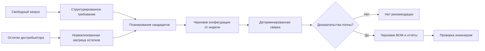

# Stock Configurator

**Рабочий MVP для пресейла инфраструктуры: из свободного запроса менеджера и остатков дистрибьютора собирает черновик спецификации для проверки, с явными допущениями.**

[Кейс на сайте](https://logachev.net/portfolio/stock-configurator/) · [CI](https://github.com/pavel-logachev/stock-configurator/actions/workflows/ci.yml) · [Архитектура](docs/ARCHITECTURE.md) · [Запуск локально](docs/LOCAL_DEVELOPMENT.md) · [AGPL-3.0](LICENSE)


> Схема работы на синтетических данных. Это не скриншот интерфейса и не материал клиента.

## Коротко

| Параметр | Описание |
| --- | --- |
| **Для кого** | Отделы продаж и пресейла инфраструктуры; итоговую проверку делает инженер |
| **Вход** | Свободный запрос на сервер, систему хранения или сетевое оборудование и доступные остатки дистрибьютора |
| **Результат** | Черновик BOM, краткая сводка и отчёт Excel с допущениями и открытыми вопросами |
| **Интерфейсы** | Telegram, FastAPI и отчёты Markdown или Excel для скачивания |
| **Граница решения** | Код проверяет идентификаторы, количества, цены, доказательства и состояние результата; совместимость и коммерческую готовность подтверждает инженер |
| **Статус** | Рабочий закрытый MVP; этот репозиторий — очищенная публичная версия «с чистого листа» |

## Зачем это нужно

Запросы на инфраструктуру редко приходят в виде чистой спецификации. Они приходят сообщениями вроде:

> Нужны два сервера 2U, два процессора, 512 ГБ RAM, SSD, два блока питания, склад Москва.

Чтобы превратить такую фразу в коммерческий черновик, нужно несколько разных видов работы:

- извлечь структурированное требование, не додумывая детали молча;
- сопоставить его с актуальными остатками дистрибьютора;
- рассудить о совместимости и сопутствующих компонентах;
- сохранить цены и идентификаторы товаров в точности;
- объяснить пробелы, а не навязывать рекомендацию;
- выдать результат, который инженер может проверить и передать дальше.

Stock Configurator разделяет эти обязанности. Языковые модели отвечают за смысловое извлечение и составление. Детерминированный код отвечает за интеграции, хранение, проверки, доказательства, формирование отчётов и условия выпуска.

## Роль Павла Логачёва

Я придумал и сделал Stock Configurator как самостоятельный продукт вокруг рабочего процесса, который знаю по B2B IT и системной интеграции. В моей работе: продуктовая логика, сценарий оператора в Telegram, сервис на FastAPI, граница работы с данными дистрибьюторов, слой доказательств и сверки, вывод в Excel, контракты оценки и подготовка публичного релиза.

[Кейс на сайте](https://logachev.net/portfolio/stock-configurator/) объясняет рабочий процесс пользователя и результат. Этот репозиторий даёт реализацию, которую можно изучить, тесты, архитектуру и явную границу публикации.

## Статус публичной версии

Репозиторий — **публичная версия «с чистого листа» под AGPL-3.0**, выделенная из рабочего закрытого проекта.

Включено:

- сервис FastAPI и хранение в PostgreSQL;
- реализации коннекторов OCS и Treolan;
- интеграция с ботом Telegram;
- извлечение запроса, сопоставление, составление, сверка и отчёты;
- выходные форматы Markdown и Excel;
- офлайн-контракты оценки и синтетические данные;
- миграции и автоматические тесты.

Намеренно исключено:

- закрытая история Git и состояние агентов;
- учётные данные и конфигурация развёртывания;
- запросы клиентов и ответы дистрибьюторов;
- актуальные цены, снимки остатков, ответы моделей и принятые эталонные случаи;
- идентификаторы рабочих запусков и эксплуатационные показатели.

Публичный синтетический базовый набор доказывает механику конвейера и его проверок, но не то, что конкретная модель или учётная запись дистрибьютора даст коммерчески приемлемую конфигурацию. См. [Граница публичного релиза](docs/PUBLIC_RELEASE_BOUNDARY.md).

## Граница безопасности

Система выдаёт **черновик**, а не утверждённую конфигурацию.

Результат может быть таким:

- `quote_draft_review_required` — есть достаточно подтверждённых доказательств для черновика, но проверка инженером обязательна;
- `no_recommendation` — доказательств не хватает или безопасную конфигурацию собрать нельзя;
- заблокирован или завершился ошибкой — не выполнены требования ко входным данным, доказательствам или оценке.

Модель не может подтвердить совместимость, придумать артикул, переопределить данные об остатках или превратить черновик в итоговое коммерческое предложение. Эти переходы остаются за детерминированным кодом или человеком.

## Конвейер


```mermaid
flowchart LR
    A[Свободный запрос] --> B[Структурированное требование]
    C[Остатки дистрибьютора] --> D[Нормализованная матрица остатков]
    B --> E[Планирование кандидатов]
    D --> E
    E --> F[Черновик конфигурации от модели]
    F --> G[Детерминированная сверка]
    G --> H{Доказательства полны?}
    H -->|Нет| I[Нет рекомендации]
    H -->|Да| J[Черновик BOM и отчёты]
    J --> K[Проверка инженером]
```

Модель получает ограниченный пакет доказательств. Затем сверка проверяет идентификаторы, количества, цены, обязательные роли, происхождение данных и неподтверждённые утверждения, и только после этого черновик возвращается.

Подробнее: [Архитектура](docs/ARCHITECTURE.md).

## Компоненты

| Область | Ответственность |
| --- | --- |
| `app/distributors` | Загрузка каталога и остатков через API дистрибьюторов с аутентификацией |
| `app/matching` | Нормализация требований, планирование кандидатов, построение матрицы и оркестрация |
| `app/llm` | Извлечение и составление конфигурации через OpenAI-совместимый API |
| `app/evidence` | Необязательные веб-доказательства с явным контролем провайдера и доменов |
| `app/reports` | Формирование отчётов Markdown и Excel |
| `app/evaluation` | Офлайн-сравнение с привязкой по хешам, слепая проверка и условия выпуска |
| `app/telegram_bot` | Сценарий оператора в Telegram |
| `app/api` | Конечные точки FastAPI для запусков, черновиков и получения отчётов |

## Быстрый старт в Docker

Требования: Docker Engine с Compose v2.

```bash
cp .env.example .env
docker compose up --build -d stock-api
docker compose exec stock-api alembic upgrade head
curl http://127.0.0.1:8010/health
```

Ожидаемый ответ проверки состояния:

```json
{
  "status": "ok",
  "service": "stock-configurator",
  "environment": "dev"
}
```

Интерактивная документация API доступна по адресу <http://127.0.0.1:8010/docs>.

В конфигурации по умолчанию запуск языковой модели и веб-доказательства отключены. У коннекторов дистрибьюторов нет учётных данных. Сервис Telegram включается отдельно:

```bash
docker compose --profile telegram up --build -d
```

Настраивайте реальные интеграции только в `.env`, который не попадает в Git. Никогда не коммитьте учётные данные и бизнес-данные.

## Локальная разработка

```bash
python -m venv .venv
source .venv/Scripts/activate  # Git Bash в Windows
python -m pip install --upgrade pip
python -m pip install -e ".[dev]"
ruff check .
pytest -q
```

Автоматические тесты используют заглушки и синтетические данные; им не нужны учётные данные дистрибьюторов, Telegram и языковой модели.

Подробная настройка: [Локальная разработка](docs/LOCAL_DEVELOPMENT.md).

## API

Сервис предоставляет:

- `GET /health`;
- `POST /api/v1/match`;
- `POST /api/v1/match/v3/full-category`;
- `POST /api/v1/match/v3/simple-stock-quote`;
- `GET /api/v1/match` и `GET /api/v1/match/{id}`;
- конечные точки отчётов Markdown и Excel для сохранённых запусков.

Конечным точкам предложений нужна заполненная база остатков. Для необязательного запуска ИИ дополнительно нужен явно настроенный OpenAI-совместимый адрес.

## Оценка

Условие выпуска сравнивает наборы базового и проверяемого запусков, привязанные по хешам. Проверяются:

- структурная корректность;
- подтверждённые идентификаторы товаров;
- неподтверждённые существенные утверждения;
- потери, взвешенные по бизнесу;
- критические ошибки;
- ухудшение задержки и стоимости;
- данные слепой проверки.

Набор данных в репозитории намеренно состоит из одного синтетического начального случая и остаётся ниже порога приёмки. Реальные данные оценки хранятся локально и не попадают в Git. См. [evaluation/simple_stock/v1/README.md](evaluation/simple_stock/v1/README.md).

## Безопасность и работа с данными

- Секреты читаются из переменных окружения и исключены через `.gitignore` и `.dockerignore`.
- Публичные тестовые данные синтетические.
- Реальные наборы оценки допускаются только в игнорируемых локальных каталогах.
- Инструменты выгрузки используют ограниченные транзакции базы данных только для чтения.
- Сформированные черновики всегда сохраняют явное состояние «требуется проверка инженером».

О найденных уязвимостях сообщайте через приватное сообщение об уязвимостях GitHub. См. [SECURITY.md](SECURITY.md).

## Похожие работы

Я делаю практичные внутренние инструменты, которые связывают рабочие процессы бизнеса, операционные данные, смысловую работу с помощью ИИ, детерминированные проверки и решения людей. [Прочитать кейс Stock Configurator](https://logachev.net/portfolio/stock-configurator/) или [описать похожую задачу](mailto:ai@logachev.net?subject=Infrastructure%20workflow).

## Товарные знаки

OCS, Treolan, Telegram и названия продуктов или производителей принадлежат их владельцам. Проект независим и не одобрен этими компаниями. Для использования коннекторов нужна ваша собственная учётная запись и соблюдение соответствующих условий.

## Участие

Приветствуются небольшие изменения, подкреплённые доказательствами. Меняйте смысловое поведение отдельно, добавляйте тесты и сохраняйте границу проверки. См. [CONTRIBUTING.md](CONTRIBUTING.md).

## Лицензия

© 2026 Павел Логачёв.

Распространяется по [GNU Affero General Public License v3.0](LICENSE). Если вы изменяете программу и открываете доступ к ней по сети, AGPL требует предложить пользователям этого сервиса соответствующий исходный код.
