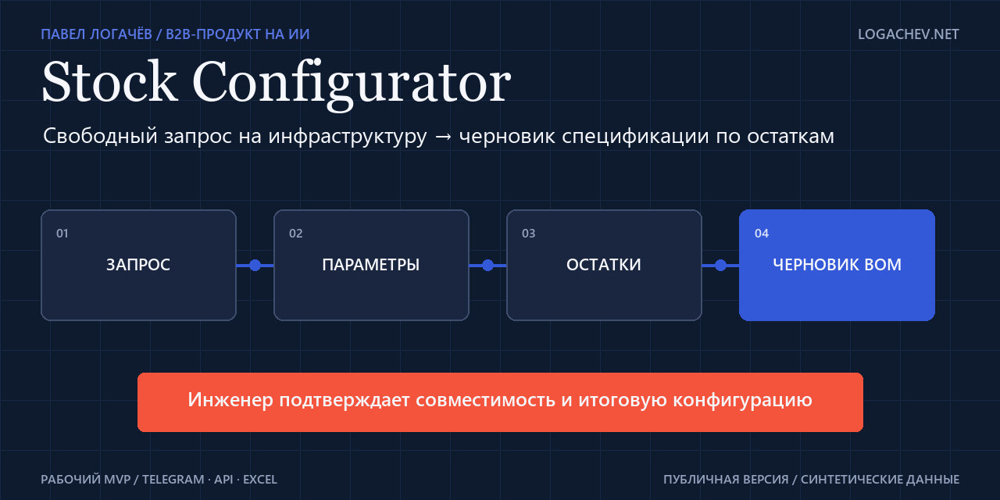
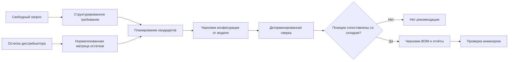

# Stock Configurator

**Клиент пишет менеджеру одной фразой: «Нужны два сервера 2U, два процессора, 512 ГБ RAM, SSD, два блока питания, склад Москва». Stock Configurator превращает такое сообщение в черновик спецификации из того, что реально лежит на складе дистрибьютора, и отдаёт инженеру Excel с позициями, ценами, остатками и списком того, что нужно проверить до коммерческого предложения.**

<p align="center">
  <a href="https://logachev.net/journal/podbor-oborudovaniya-po-skladu-ii/">Статья о проекте</a> &nbsp;·&nbsp;
  <a href="https://github.com/pavel-logachev/stock-configurator/actions/workflows/ci.yml">CI</a> &nbsp;·&nbsp;
  <a href="docs/ARCHITECTURE.md">Архитектура</a> &nbsp;·&nbsp;
  <a href="docs/LOCAL_DEVELOPMENT.md">Запуск локально</a> &nbsp;·&nbsp;
  <a href="LICENSE">AGPL-3.0</a>
</p>

> Первая рабочая версия для пресейла инфраструктуры. Здесь опубликована очищенная копия рабочего проекта: схема и тестовые данные синтетические, клиентских данных и учётных записей нет.

## Коротко

| | |
| --- | --- |
| **Для кого** | Менеджеры и инженеры пресейла в продажах серверов, СХД и сетевого оборудования |
| **На входе** | Запрос обычным текстом и остатки дистрибьютора, полученные через API |
| **На выходе** | Черновик BOM, краткая сводка, Excel и Markdown с допущениями и открытыми вопросами |
| **Интерфейсы** | Telegram-бот и API на FastAPI |
| **Кто за что отвечает** | Модель разбирает запрос, собирает конфигурацию и оценивает совместимость. В сценарии Telegram-бота код сверяет конфигурацию с данными склада, в маршруте API `full-category` проверяет только схему ответа. Инженер проверяет состав и готовность к КП |

## Почему не просто чат-бот

Если попросить чат-бота подобрать сервер, он может назвать несуществующий артикул, предложить несовместимые компоненты и ничего не знает о сегодняшних остатках.

Здесь модель выбирает только из позиций, которые код получил у дистрибьютора. В сценарии Telegram-бота код затем переносит её выбор на реальные складские строки: артикул, цена и остаток берутся из данных дистрибьютора, суммы пересчитываются. Если модель заказала больше, чем есть на складе, код уменьшает количество и отмечает это в результате. Если дистрибьютор указал остаток только нижней границей, например «>1», количество остаётся таким, как заказано, а в результате появляется пометка: доступность выбранного количества нужно подтвердить до отправки КП. Если в ответе модели есть позиция, которой нет среди полученных данных, черновик не выдаётся. Если подходящего оборудования нет, система так и отвечает.

## Что видит инженер

Первый лист Excel — «Предварительная спецификация для КП»: позиции, количество на один сервер и на весь заказ, остаток на складе. Ниже комментарий к подбору и блок «Проверить перед КП», например список поддерживаемых процессоров и BIOS, совместимость памяти и правила установки модулей, бэкплейн под накопители, блоки питания, рельсы и кабели, гарантия и срок поставки. Отдельные листы содержат рекомендации модели и матрицу компонентов. Тот же результат сохраняется в Markdown.

У каждого результата есть явное состояние:

- `quote_draft_review_required` — черновик собран, перед КП его проверяет инженер;
- `quote_candidate_customer_ready` — черновик собран, и модель указала, что отдельная инженерная проверка не нужна;
- `no_recommendation` — подтверждений не хватает или безопасную конфигурацию собрать нельзя;
- заблокирован или завершился ошибкой — позиции не удалось сопоставить со складом или не выполнены требования к входным данным.

В сценарии Telegram-бота (маршрут `simple-stock-quote`) код проверяет складскую часть: позиции должны быть в данных дистрибьютора, количество не может превышать точно указанный остаток, цены и суммы берутся из данных дистрибьютора. В маршруте API `full-category` такой сверки нет: код проверяет только схему ответа модели, подробнее об этом ниже. Совместимость компонентов и полноту конфигурации в обоих маршрутах оценивает модель, поэтому её вывод остаётся черновиком: состав оборудования и готовность к коммерческому предложению проверяет инженер.

## Конвейер


```mermaid
flowchart LR
    A[Свободный запрос] --> B[Структурированное требование]
    C[Остатки дистрибьютора] --> D[Нормализованная матрица остатков]
    B --> E[Планирование кандидатов]
    D --> E
    E --> F[Черновик конфигурации от модели]
    F --> G[Детерминированная сверка]
    G --> H{Позиции сопоставлены со складом?}
    H -->|Нет| I[Нет рекомендации]
    H -->|Да| J[Черновик BOM и отчёты]
    J --> K[Проверка инженером]
```

Модель получает ограниченный пакет данных. В сценарии Telegram-бота, который идёт через маршрут `simple-stock-quote`, выбор ролей и совместимость решает модель, а код проверяет складскую часть: перед выдачей черновика сверяет идентификаторы, количества и цены со складом и пересчитывает итоги. В маршруте `full-category` (`POST /api/v1/match/v3/full-category`) код проверяет только, что ответ модели соответствует схеме. Механическая сверка со складом там отключена: конфигурация модели передаётся менеджеру на проверку со статусом `valid_unchecked` и предупреждением `code_validation_bypassed`. Подробнее — в [архитектуре](docs/ARCHITECTURE.md).

## Компоненты

| Область | Что делает |
| --- | --- |
| `app/distributors` | Загружает каталог и остатки через API дистрибьюторов с аутентификацией |
| `app/matching` | Нормализует требования, планирует кандидатов, строит матрицу, управляет запуском |
| `app/llm` | Разбирает запрос и собирает конфигурацию через OpenAI-совместимый API |
| `app/evidence` | Необязательные веб-подтверждения с явным выбором провайдера и доменов |
| `app/reports` | Формирует отчёты Markdown и Excel |
| `app/evaluation` | Офлайн-сравнение запусков с привязкой по хешам, слепая проверка, условия выпуска |
| `app/telegram_bot` | Сценарий оператора в Telegram |
| `app/api` | Конечные точки FastAPI для запусков, черновиков и отчётов |

## Что опубликовано, а что нет

Публичная версия выделена из рабочего закрытого проекта.

Включено: сервис FastAPI и хранение в PostgreSQL, коннекторы OCS и Treolan, Telegram-бот, разбор запроса, сопоставление, сборка, сверка и отчёты в Markdown и Excel, офлайн-контракты оценки, синтетические данные, миграции и автоматические тесты.

Исключено намеренно: закрытая история Git и состояние агентов, учётные данные и конфигурация развёртывания, запросы клиентов и ответы дистрибьюторов, актуальные цены и снимки остатков, ответы моделей и принятые эталонные случаи, идентификаторы рабочих запусков и эксплуатационные показатели.

Синтетический набор проверяет, что конвейер работает. Чтобы оценить качество подбора, нужны реальные данные выбранной модели и дистрибьютора. Подробности — в [границе публичного релиза](docs/PUBLIC_RELEASE_BOUNDARY.md).

## Быстрый старт в Docker

Нужен Docker Engine с Compose v2.

```bash
cp .env.example .env
docker compose up --build -d stock-api
docker compose exec stock-api alembic upgrade head
curl http://127.0.0.1:8010/health
```

Ожидаемый ответ:

```json
{
  "status": "ok",
  "service": "stock-configurator",
  "environment": "dev"
}
```

Интерактивная документация API открывается по адресу <http://127.0.0.1:8010/docs>. Сервис слушает только локальный адрес компьютера.

По умолчанию вызовы языковой модели и веб-подтверждения выключены, у коннекторов дистрибьюторов нет учётных данных. Так можно сначала решить, какие данные и куда передавать, и только потом включать обработку. Telegram-бот запускается отдельно:

```bash
docker compose --profile telegram up --build -d
```

Реальные интеграции настраиваются только в `.env`, который не попадает в Git. Учётные и бизнес-данные в репозиторий не коммитьте.

## Локальная разработка

```bash
python -m venv .venv
source .venv/Scripts/activate  # Git Bash в Windows
python -m pip install --upgrade pip
python -m pip install -e ".[dev]"
ruff check .
pytest -q
```

Тесты работают на заглушках и синтетических данных; учётные данные дистрибьюторов, Telegram и языковой модели им не нужны. CI дополнительно проверяет конфигурацию Compose, применяет миграции к PostgreSQL, собирает Docker-образ и проверяет зависимости. Подробная настройка — в [локальной разработке](docs/LOCAL_DEVELOPMENT.md).

## API

- `GET /health`
- `POST /api/v1/match`
- `POST /api/v1/match/v3/full-category`
- `POST /api/v1/match/v3/simple-stock-quote`
- `GET /api/v1/match` и `GET /api/v1/match/{id}`
- отчёты Markdown и Excel для сохранённых запусков

Конечным точкам подбора нужна заполненная база остатков. Для запуска с моделью дополнительно нужен явно настроенный OpenAI-совместимый адрес.

## Оценка

Перед выпуском оценщик сравнивает базовый и проверяемый запуски, привязанные по хешам:

- структурная корректность;
- подтверждённые идентификаторы товаров;
- неподтверждённые существенные утверждения;
- потери, взвешенные по значимости для бизнеса;
- критические ошибки;
- ухудшение задержки и стоимости;
- данные слепой проверки.

В репозитории намеренно лежит один синтетический начальный случай, и он ниже порога приёмки. Реальные данные оценки хранятся локально и в Git не попадают. См. [evaluation/simple_stock/v1/README.md](evaluation/simple_stock/v1/README.md).

## Безопасность и данные

- Секреты читаются из переменных окружения и исключены через `.gitignore` и `.dockerignore`.
- Публичные тестовые данные синтетические; реальные наборы оценки допускаются только в игнорируемых локальных каталогах.
- Инструменты выгрузки работают в ограниченных транзакциях базы данных только для чтения.
- Сформированный черновик не отправляется клиенту автоматически; результат получает оператор.

Об уязвимостях сообщайте через приватное сообщение об уязвимостях GitHub, см. [SECURITY.md](SECURITY.md).

## Автор

Stock Configurator придумал и сделал Павел Логачев для процесса, который знает по B2B IT и системной интеграции: продуктовую логику, сценарий оператора в Telegram, сервис на FastAPI, получение и сверку данных дистрибьюторов, вывод в Excel и контракты оценки. Если у вас похожая задача с большим складом или каталогом, [напишите](mailto:ai@logachev.net?subject=%D0%9F%D0%BE%D1%85%D0%BE%D0%B6%D0%B0%D1%8F%20%D0%B7%D0%B0%D0%B4%D0%B0%D1%87%D0%B0%3A%20%D0%BF%D0%BE%D0%B4%D0%B1%D0%BE%D1%80%20%D0%BF%D0%BE%20%D0%BE%D1%81%D1%82%D0%B0%D1%82%D0%BA%D0%B0%D0%BC).

## Товарные знаки

OCS, Treolan, Telegram и названия продуктов и производителей принадлежат их владельцам. Проект независим и этими компаниями не одобрен. Для работы коннекторов нужна ваша собственная учётная запись и соблюдение условий соответствующего сервиса.

## Участие

Предлагайте небольшие изменения с тестами и данными, которые подтверждают результат. Изменения в работе модели оформляйте отдельно и не отключайте проверку результата. См. [CONTRIBUTING.md](CONTRIBUTING.md).

## Лицензия

© 2026 Павел Логачев. Распространяется по [GNU Affero General Public License v3.0](LICENSE). Если вы изменяете программу и даёте к ней доступ по сети, AGPL требует предложить пользователям этого сервиса соответствующий исходный код.
